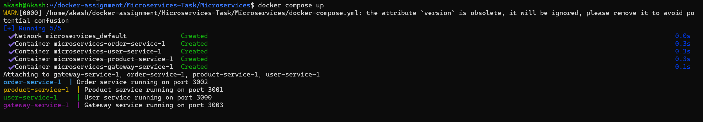
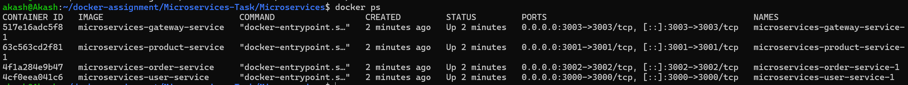
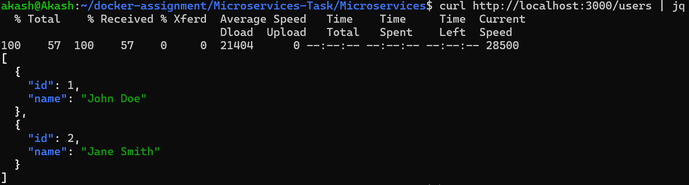
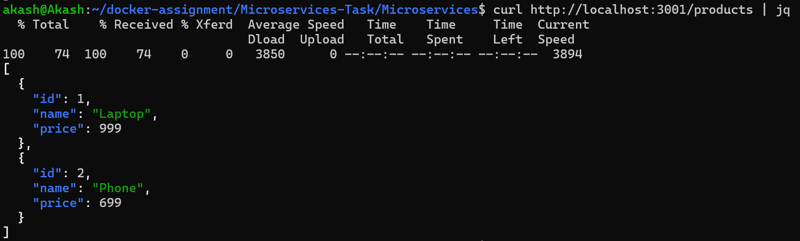
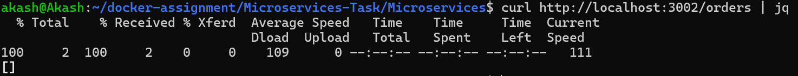
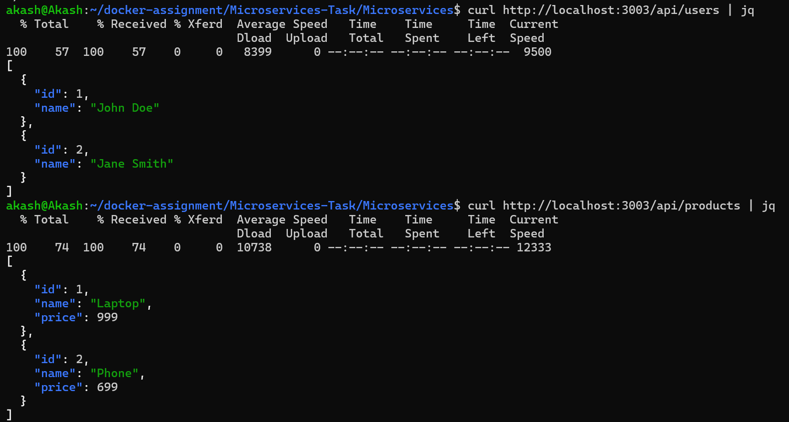
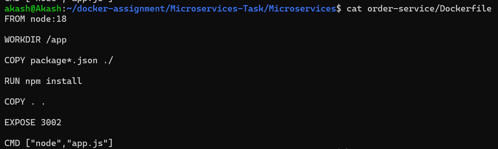
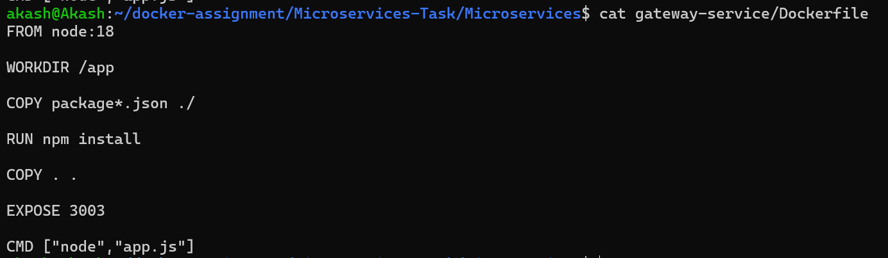
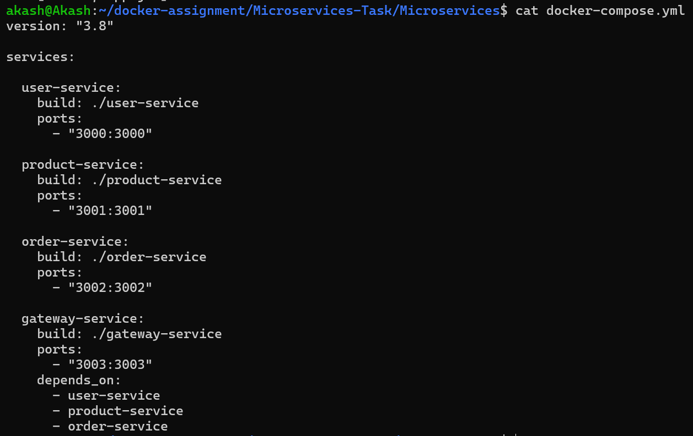

# Containerized Microservices — Node.js + Docker + Docker Compose

A microservices-based application consisting of four Node.js services containerized with Docker and orchestrated using Docker Compose.

---

## Project Structure

```
submission/
├── user-service/
│   └── Dockerfile
├── product-service/
│   └── Dockerfile
├── order-service/
│   └── Dockerfile
├── gateway-service/
│   └── Dockerfile
├── docker-compose.yml
└── README.md
```

---

## Setup & Running the Application

### 1. Clone the Repository

```bash
git clone https://github.com/akashagarwal99-oss/Microservices-Task.git
cd Microservices-Task
```

### 2. Build and Start All Services

```bash
docker compose up
```

This command will:
- Build Docker images for all four services
- Create and attach them to the shared `microservices-network`
- Start all containers in the foreground with combined logs

### 3. Verify All Services Are Running

```bash
docker ps
```

You should see all four services with status `Up` or `running`.

---

## Screenshot: Services Running in Docker





---

## Testing Each Service

Once all containers are up, you can test each service using `curl` or your browser.

### User Service — Port 3000

```bash
curl http://localhost:3000/users
```

Expected response: JSON response from the User Service.



---

### Product Service — Port 3001

```bash
curl http://localhost:3001/products
```

Expected response: JSON response from the Product Service.



---

### Order Service — Port 3002

```bash
curl http://localhost:3002/orders
```

Expected response: JSON response from the Order Service.



---

### Gateway Service — Port 3003

```bash
curl http://localhost:3003/api/users

curl http://localhost:3003/api/products
```

Expected response: JSON response routed through the Gateway.



---

## Stopping the Application

```bash
# Stop and remove containers (keeps images)
docker compose down

# Stop and remove containers + images + volumes
docker compose down --rmi all -v
```

---

## Dockerfile Overview

Each service uses the same Dockerfile pattern:

```dockerfile
FROM node:18-alpine
WORKDIR /app
COPY package*.json ./
RUN npm install
COPY . .
EXPOSE <PORT>
CMD ["node", "index.js"]
```

| Service         | Base Image      | Port |
|-----------------|-----------------|------|
| user-service    | node:18-alpine  | 3000 |
| product-service | node:18-alpine  | 3001 |
| order-service   | node:18-alpine  | 3002 |
| gateway-service | node:18-alpine  | 3003 |

### Screenshot: user-service Dockerfile


---

### Screenshot: product-service Dockerfile


---

### Screenshot: order-service Dockerfile



---

### Screenshot: gateway-service Dockerfile



---

## Docker Compose Overview

The `docker-compose.yml` defines:
- All four services with correct port mappings
- A shared bridge network (`microservices-network`) for inter-service communication
- Build contexts pointing to each service directory

### Screenshot: docker-compose.yml



---

## Conclusion

This project successfully containerizes a Node.js microservices-based application using Docker and Docker Compose. All services were built, deployed, and tested successfully, demonstrating container orchestration, inter-service communication, and API accessibility through a centralized Gateway Service.
